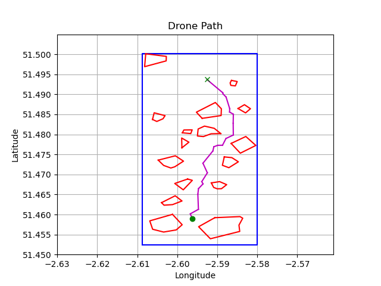
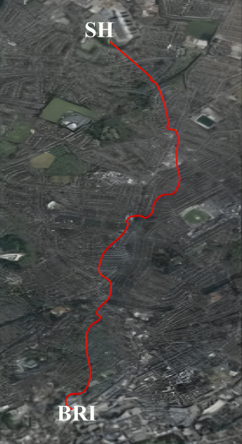

# delaunay-waypoint-generator-drone
# Optimised Drone Path Planning Using Delaunay Triangulation

## Project Description
This project evaluates the best flight path for delivering medical supplies between **Bristol Royal Infirmary** and **Southmead Hospital** using Delaunay Triangulation for obstacle-aware path planning. It highlights the practical application of computational geometry in autonomous drone navigation. 

<!-- Display the images side by side -->
<div align="center">
  
  
</div>
<!-- Centralised figure description -->
<div align="center">
  <p>Figures: (Left) Optimal Path using Delaunay Triangulation, (Right) Simulated Path with 'Spline Waypoints'</p>
</div>


### Key Features:
- Obstacle-aware flight path planning.
- Integration with [Mission Planner](https://ardupilot.org/planner/) for waypoint generation and simulation.
- Visualisation of helipads, obstacles, and optimised paths.
- Customisable altitude settings and choice of starting helipad.

#### Technologies Used:
- Python (core logic and visualisation)
- [Mission Planner](https://ardupilot.org/planner/) for waypoint simulation
- [Drone Safety Map](https://dronesafetymap.com/) for restricted airspace data

### Challenges Faced:
- Handling complex obstacle geometries efficiently.
- Ensuring compatibility with [Mission Planner](https://ardupilot.org/planner/)'s waypoint format.
- Balancing path optimisation with computational efficiency.

### Future Enhancements:
***Overall Agorithm Improvements***
- Implement dynamic obstacle detection and avoidance.
- Implement a 3D path planning algorithm.

***Code Quality & Organisation Improvements***
- Implement error handling to manage potential exceptions, such as file not found errors when reading obstacle files or issues during triangulation.
- Automating the import process into [Mission Planner](https://ardupilot.org/planner/).
- Develop an interactive GUI to allow users to input parameters, visualize obstacles, and view the generated path interactively.

## Table of Contents
1. [File Definitions](#file-definitions)
2. [How to Install and Run the Project](#how-to-install-and-run-the-project)
3. [How to Use the Project](#how-to-use-the-project)
4. [Mission Planner Instructions (External)](#mission-planner-instructions-external)
5. [Credits](#credits)

## File Definitions
- **`MAIN_waypoint_generator.py`**: Evaluates the optimal flight path using Delaunay Triangulation. Users can customise flight altitude above terrain (`alt`) and the starting helipad (`start_hospital`)
- **Obstacle Files (`obstacle_files/obstacle_xxx.poly`)**: Coordinates of restricted airspaces created using [Mission Planner](https://ardupilot.org/planner/) and [Drone Safety Map](https://dronesafetymap.com/). These are read by **`Obstacle_Reader_v2.py`**.
- **`Delaunay_Triangulation_v2.py`**: Processes obstacle locations and start/goal points to generate the optimal path within a defined workspace.

## How to Install and Run the Project
1. Clone the repository:
   ```bash
   git clone https://github.com/celalk-172/delaunay-waypoint-generator
   ```
2. Install required dependencies:
   ```bash
   pip install -r requirements.txt
   ```
3. Run the project:
   ```bash
   python MAIN_waypoint_generator.py
   ```

## How to Use the Project
1. Run the main file: ```python MAIN_waypoint_generator.py```
   - Specify the starting hospital and the flight altitude in ```MAIN_waypoint_generator.py``` if desired.
2. Observe the visualisation plots:
   - Helipads and obstacles within the workspace.
   - Delaunay triangulation process.
   - Final optimised flight path.
3. Retrieve the waypoint file (`MissionPlanner_Waypoints.txt`) for use in [Mission Planner](https://ardupilot.org/planner/).

## Mission Planner Instructions (External)
1. Open Mission Planner and navigate to the **PLAN** tab.
2. Load `MissionPlanner_Waypoints.txt`. Increase WP radius to 15m for smoother turns.
3. Go to **SIMULATION** and select the Multirotor (Stable Version).
4. Resolve arming/disarming issues:
   - Navigate to **CONFIG** > Full Parameter List.
   - Set `AUTO_OPTIONS` to "Allow Arming" and "Allow Takeoff Without Raising Throttle."
5. Write the waypoints in **PLAN**.
6. In **DATA** > Actions, set the mode to **AUTO** and arm the drone.

The drone will take off and follow the optimised path between hospitals.

### Notes:
- Simulated drone speed: 10 m/s. Real-world speed of the selected drone ([DJI Matrice 300 RTK](https://www.dji.com/uk/support/product/matrice-300)): up to 17 m/s.
- Expected real-world delivery time: <6 minutes.
- Flights will ideally be at 100m above ground, enabling 2D algorithms to be sufficient for path planning. This can be (optionally) varied in ```MAIN_waypoint_generator.py```. 

## Credits
- **Author:** Celal Konuklu ([GitHub Profile](https://github.com/celalk-172))
- **Acknowledgements:**
  - [Dr. Arthur Richards](https://github.com/arthurrichards77/smply) for providing the algorithm inspiration.

**Note:** A detailed PDF document outlining the medical delivery campaign is also included in the repository. It describes the project’s potential real-world application, logistics, and expected benefits for the healthcare sector.

---

For more details, refer to the project files and documentation.

